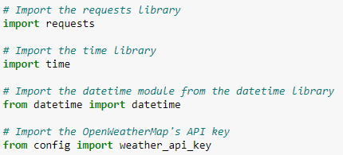

# PLANMYTRIP: World Weather Analysis App

## Overview of PLANMYTRIP
In this module, we have been asked to help an employee at PLANMYTRIP, which is a travel technology company. We wanted to gather weather data for cities around the world so that customers can specify their preferred travel criteria to find an ideal hotel anywhere in the world. We generated a list of 500 random cities then an API to find current weather data. Then we plotted relationships between these cities' latitudes and the weather data.

In this Challenge assignment, we have been tasked with making updates to the PLANMYTRIP app, specifically adding a description of the current weather and creating a travel itinerary based on four cities. We have been given the three deliverables shown below (from the Module Challenge webpage), along with subtasks for each deliverable which we will walk through further down. The text for each deliverable is taken from the starter files. Below each subtask is an image of the code necessary to complete it. Output from running the code can be found in the submitted .ipynb files.

- Deliverable 1: Retrieve Weather Data. Generate a set of 2,000 random latitudes and longitudes, retrieve the nearest city, and perform an API call with OpenWeatherMap to collect current weather information for each city.
- Deliverable 2: Create a Customer Travel Destinations Map. Employ input statements to retrieve customer weather preferences. Use those preferences to identify potential travel destinations and nearby hotels. Then show those destinations on a map on which weather information can be viewed by hovering over a given city.
- Deliverable 3: Create a Travel Itinerary Map. Use the Geoapify Routing API to create a travel itinerary that shows the route between four cities chosen from the customer's possible travel destinations. Then create a map with a pop-up marker for each city on the itinerary.

## Resources
- Software: Python 3.7.7, Conda 22.11.0, Jupyter Notebook 5.7.10, Citipy 0.0.5, HVPlot 0.8.0, GeoViews 1.9.5

## Deliverable 1: Retrieve Weather Data

1. Use the `np.random.uniform` function to generate a new set of 2,000 random latitudes and 2,000 longitudes.

    

    

2. Use the `citipy` module to get the nearest city for each latitude and longitude combination.

    

3. Import your OpenWeatherMap's API key and assemble the API call URL as a string variable. Recall to edit the `config.py` file to add your API key.

    

    

4. Retrieve the following information from the API call.
    - The latitude and longitude
    - The Max temperature
    - The % humidity
    - The % cloudiness
    - The Wind speed
    - The Weather description, i.e., cloudy, fog, light rain, clear sky, etc.

    

    

5. Add the weather data to a new DataFrame.

    

    

    

    

    

    

6. Export the DataFrame as a CSV file, and save it as `WeatherPy_Database.csv` in the `Weather_Database` folder.

    

**The resulting data file can be found here: [WeatherPy_Database.csv](Weather_Database/WeatherPy_Database.csv).**

## Deliverable 2: Create a Customer Travel Destinations Map

1. Ensure that the dependencies and the Geoapify API key is imported correctly.

    

2. From the `Weather_Database` folder you created in Deliverable 1, import the `WeatherPy_Database`.csv file as a Pandas DataFrame named `city_data_df`.

    

3. Write two input statements that prompt the user to enter their minimum and maximum temperature criteria for their vacation.

    

4. Create a new Pandas DataFrame by using the `loc` Pandas method to filter the `city_data_df` DataFrame for temperature criteria collected. Name the DataFrame as `preferred_cities_df`.

    

5. Create a new Pandas DataFrame named `clean_travel_cities` by using the Pandas `dropna` function on the `preferred_cities_df` to drop any empty rows.

    

6. Use the `copy` Pandas function to create a new DataFrame, called `hotel_df`, by copying the following columns from the `clean_travel_cities` DataFrame: "City", "Country", "Max Temp", "Current Description", "Lat", "Lng".

    

7. Add a new empty column named `Hotel Name` to the `hotel_df` DataFrame.

    

8. Review the hotel search parameters provided. These parameters are the same we used in this module; you'll use them to search for a hotel for each city

    

9. Use a for loop to iterate through the `hotel_df` DataFrame. Retrieve the latitude and longitude of each city and use the Geoapify API to find the nearest hotel based on the search parameters provided, then add the hotel name to the `hotel_df` DataFrame. If a hotel isn't found, set the hotel name as "No hotel found".

    

10. Drop any rows in the `hotel_df` DataFrame where a hotel name is not found and store the resulting data into a new DataFrame named `clean_hotel_df`.

    

11. Create an CSV file to store the `clean_hotel_df` DataFrame as `WeatherPy_vacation.csv` in the `Vacation_Search` folder.

    

12. Use GeoViews to create a map that displays a point for every city in the `clean_hotel_df` DataFrame.

    

 **The resulting data file can be found here:** [WeatherPy_vacation.csv](Vacation_Search/WeatherPy_vacation.csv).

**The resulting map can be found here:** 

## Deliverable 3: Create a Travel Itinerary Map

1. Make sure the initial dependencies and the Geoapify API key are imported.

    

2. From your `Vacation_Search` folder from Deliverable 2, import the `WeatherPy_vacation.csv` file as a DataFrame named `vacation_df`.

    

3. Use GeoViews to create a map that shows all the cities in the `vacation_df` DataFrame. Configure the map as follows:
    - The point's size should be the maximum temperature for the city
    - The point's color should be the city's name
    - Use the `hover_cols` parameter to the the "Hotel Name", "Country", and "Current Description" columns to each point as additional information.

    

4. From the map, choose four cities that a customer might want to visit. They should be close together and in the same country. Use the `loc` method to create separate DataFrames for each city on the travel route.

    

5. Use the Pandas `concat` function to merge the DataFrame from each city in the itinerary to create a new DataFrame named `itinerary_df` to store the itinerary details.

    

6. Use the Pandas `copy` function to create a new DataFrame named `waypoints_df` to store the longitude and latitude for each city in `itinerary_df`.

    

7. Use GeoViews to create map that shows the four cities in the itinerary.

    

    

8. Next, you'll use the Geoapify Routing API to find a route between the cities in the itinerary. Review the code that sets the initial parameters and fetches the coordinates from each city to define the `waypoints` parameter by using a `for` loop.

    

    

9. Use the Geoapify Routing API to retrieve the route's directions for your itinerary.

    

10. From the JSON response, store the route's legs coordinates in a variable called `legs`.

    

11. Loop through the route legs coordinates to fetch the latitude and longitude for each step. Store the latitude and longitude value into two Python lists names `longitude` and `latitude`.

    

12. Use the `longitude` and `latitude` Python lists to create a new DataFrame named `route_df`.

    

13. Use the GeoViews `Path` function to configure a line plot by using `route_df`. Set a custom color and width for the line that may contrast with the map

    

    

**The resulting travel itinerary map can be found here:**

